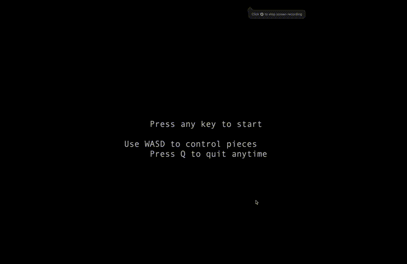

# Tetris Game

A Tetris implementation built in C using the ncurses library for terminal-based gameplay. 

## Installation

On macOS, install the required dependencies using Homebrew:
```bash
brew install ncurses
```

On Ubuntu or Debian systems, install the development libraries:
```bash
sudo apt-get install libncurses5-dev libncursesw5-dev
```

## Building the Game

The project includes a Makefile for simplified building. Navigate to the project directory and execute the build command:

```bash
make
```

This command compiles all source files and creates the executable named `tetris`.

## Running the Game

Start the game by executing the compiled binary:

```bash
./tetris_ncurses
```

Alternatively, use the Makefile to build and run in one step:

```bash
make run
```

## Controls

The game uses keyboard controls for all interactions:

- **W** or **w**: Rotate the current piece clockwise
- **A** or **a**: Move piece left
- **D** or **d**: Move piece right  
- **S** or **s**: Soft drop (faster descent)
- **Space**: Hard drop (instant placement)
- **Q** or **q**: Quit the game

## Play

